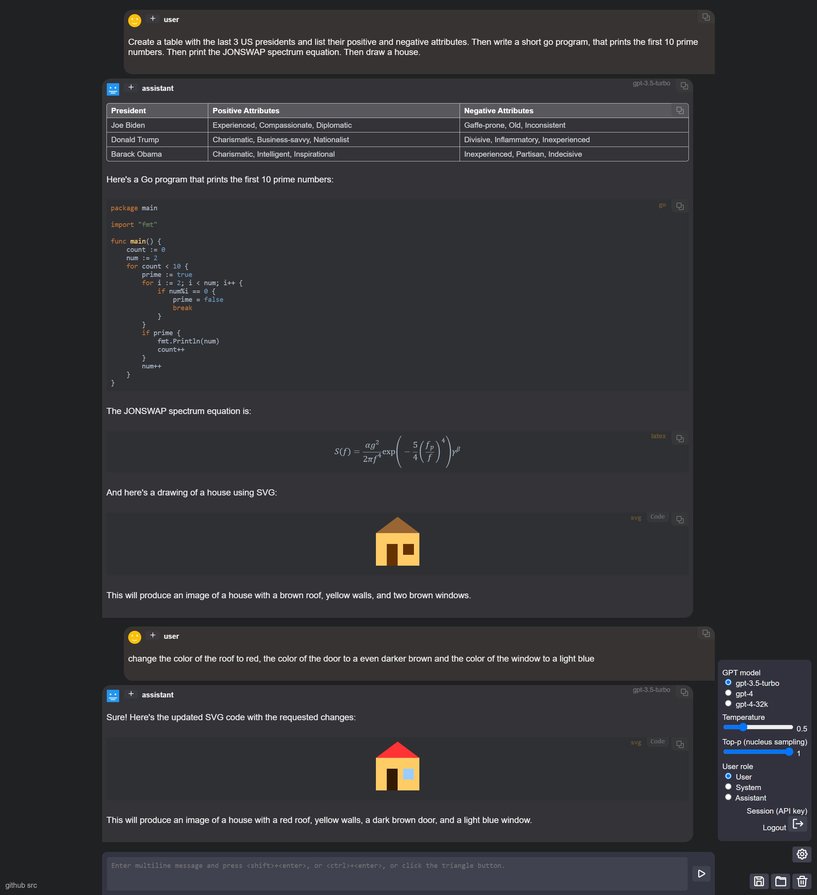

# AIFlow Chat

An open-source chat application designed for interacting with AI models through OpenAI-compatible APIs. It supports features like customizable "Agents", automatable "Flows", and external "Tools" via the Model Context Protocol (MCP). It is built with vanilla JavaScript, HTML, and CSS, emphasizing a modular, plugin-based architecture for easy extension.

> **Warning**: This is a personal project developed in my spare time. It is provided "as is" with no warranty.

## Key Features

- **AI Interactions**: Stream responses from AI models, rendering Markdown, code blocks with syntax highlighting, mathematical formulas (via KaTeX), and SVG images.
- **Customizable Agents**: Define multiple "agents," each with its own unique system prompt, API endpoints, settings, and permissions. This allows you to switch between different AI personalities or configurations seamlessly.
- **Automatable Flows**: Create and execute complex, node-based workflows to automate repetitive tasks and chain multiple AI prompts together.
- **External Tool Support**: Integrate external tools (like web search or file I/O) using the Model Context Protocol (MCP), enabling the AI to interact with external systems.
- **Rich Chat Management**: Enjoy features like multiple concurrent chats, conversation branching, editing/deleting messages, and exploring alternative AI responses.

## Architecture Overview

The application is built around a core set of managers and services, with most features being implemented as plugins.

- **`main.js`**: The main entry point of the application. It initializes the core `App` class, which orchestrates all other components and manages the main UI.
-   **`plugin-manager.js`**: The heart of the application's extensibility. It provides a hook-based system where plugins can register to be notified of specific events and modify application behavior or data.
-   **`chat-data.js`**: Defines the core data structures for chat history. A chat is modeled as a tree of messages, allowing for complex conversational branching and the exploration of alternative AI responses.
-   **`api-service.js`**: A self-contained service for handling all communication with OpenAI-compatible APIs. It manages endpoint construction, authentication, and the complexities of streaming responses.
-   **`response-processor.js`**: The engine that drives the AI interaction cycle. It finds pending AI turns, calls the `ApiService`, and triggers plugin hooks upon completion, allowing for multi-step agent and tool interactions.
-   **`js/plugins/`**: This directory contains all the feature-implementing plugins. Each plugin is a self-contained module that registers its functionality (hooks, UI components, etc.) with the `pluginManager`.

## Getting Started

#### Online Demo
A (sometimes outdated) version is available for testing at: [https://huggingface.co/spaces/dma123/aiflow-chat](https://huggingface.co/spaces/dma123/aiflow-chat).

#### Local Setup
1.  **Clone the repository**:
    `git clone https://github.com/dmatscheko/aiflow-chat.git`

2.  **Run the web server**:
    The project includes a simple Python-based server that also provides an MCP proxy for enabling tools.
    -   Run the server from the project root: `uv run main.py`
    -   This will start a web server at `http://127.0.0.1:8000` and a MCP proxy at `http://127.0.0.1:3000/mcp`.

3.  **Open the application**:
    Open `http://127.0.0.1:8000` in your web browser.

## User Controls

-   **Chat Input**: Type your message in the text area at the bottom. Press `Enter` to send, or `Shift+Enter` to add a new line.
-   **Stop Generation**: Press the `Stop` button or hit the `Escape` key to halt a response that is in progress.
-   **Message Actions**: Each message has a set of controls:
    -   **Edit**: Modify the content of your own messages.
    -   **Delete**: Remove a message and its entire conversational branch.
    -   **Branch**: Start a new conversational path from that point.
    -   **Alternatives**: Cycle through different AI-generated responses for a single prompt.
-   **Sidebar Tabs**:
    -   **Chats**: Manage all your conversations. Create, delete, and switch between them.
    -   **Agents**: Create and configure different AI agents.
    -   **Flows**: Build and run automated, multi-step workflows.
-   **Settings**: The `Default Agent` is a special agent whose settings serve as the application's global defaults. Use its editor to configure your primary API key, endpoint, model, and other preferences.

## How to Contribute

This is an open-source project, and contributions are welcome! Here are some ways you can help:

1.  **Reporting Bugs**: If you find a bug, please open an issue on the GitHub repository. Include as much detail as possible, such as steps to reproduce, screenshots, and console error messages.
2.  **Suggesting Features**: Have an idea for a new feature? Open an issue to describe your suggestion and discuss it with the community.
3.  **Submitting Pull Requests**: If you'd like to contribute code, please fork the repository and submit a pull request. For new features, it's a good idea to discuss your plan in an issue first.

When contributing, please try to follow the existing code style and conventions. The project uses JSDoc for documentation, so please add comments to any new functions or classes.

### Screenshot
This screenshot was "randomly selected" because its output was ok-ish ;)

